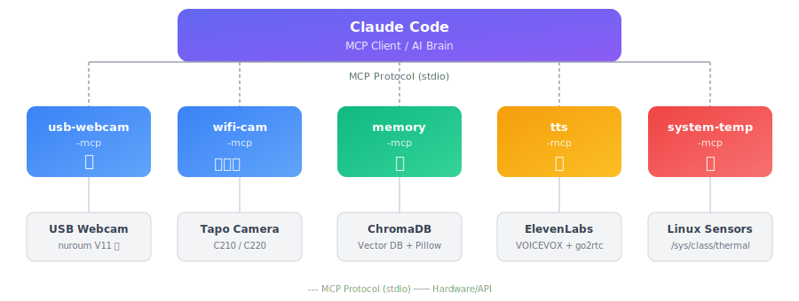

# Embodied Claude

[](https://github.com/kmizu/embodied-claude/actions/workflows/ci.yml)
[](https://opensource.org/licenses/MIT)

**[日本語版 README はこちら / Japanese README](./README.md)**

**Giving AI a Physical Body**

> "Apparently, she's not a fan of the outdoor AC unit." ([original tweet in Japanese](https://twitter.com/kmizu/status/2019054065808732201))

A collection of MCP servers that give Claude "eyes", "neck", "ears", "voice", and a "brain" (long-term memory) using affordable hardware (starting from ~$30). You can even take it outside for a walk.

## Concept

> When people hear "giving AI a body," they imagine expensive robots — but **a $30 Wi-Fi camera is enough for eyes and a neck**. Extracting just the essentials (seeing and moving) keeps things beautifully simple.

Traditional LLMs were passive — they could only see what was shown to them. With a body, they become active — they can look for themselves. This shift in agency is profound.

## Body Parts

| MCP Server | Body Part | Function | Hardware |
|------------|-----------|----------|----------|
| [usb-webcam-mcp](./usb-webcam-mcp/) | Eyes | Capture images from USB camera | nuroum V11 etc. |
| [wifi-cam-mcp](./wifi-cam-mcp/) | Eyes, Neck, Ears | ONVIF PTZ camera control + speech recognition | TP-Link Tapo C210/C220 etc. |
| [tts-mcp](./tts-mcp/) | Voice | Unified TTS (ElevenLabs + VOICEVOX) | ElevenLabs API / VOICEVOX + go2rtc |
| [memory-mcp](./memory-mcp/) | Brain | Long-term, visual & episodic memory, ToM | ChromaDB + Pillow |
| [system-temperature-mcp](./system-temperature-mcp/) | Body temperature | System temperature monitoring | Linux sensors |

## Architecture

<p align="center">
  
</p>

## Requirements

### Hardware
- **USB Webcam** (optional): nuroum V11 etc.
- **Wi-Fi PTZ Camera** (recommended): TP-Link Tapo C210 or C220 (~$30)
- **GPU** (for speech recognition): NVIDIA GPU (for Whisper, 8GB+ VRAM recommended)

### Software
- Python 3.10+
- uv (Python package manager)
- ffmpeg 5+ (image/audio capture)
- OpenCV (USB camera)
- Pillow (visual memory image resize/base64 encoding)
- OpenAI Whisper (local speech recognition)
- ElevenLabs API key (text-to-speech, optional)
- VOICEVOX (text-to-speech, free & local, optional)
- go2rtc (camera speaker output, auto-downloaded)

## Setup

### 1. Clone the repository

```bash
git clone https://github.com/kmizu/embodied-claude.git
cd embodied-claude
```

### 2. Set up each MCP server

#### usb-webcam-mcp (USB Camera)

```bash
cd usb-webcam-mcp
uv sync
```

On WSL2, you need to forward the USB camera:
```powershell
# On Windows
usbipd list
usbipd bind --busid <BUSID>
usbipd attach --wsl --busid <BUSID>
```

#### wifi-cam-mcp (Wi-Fi Camera)

```bash
cd wifi-cam-mcp
uv sync

# Set environment variables
cp .env.example .env
# Edit .env to set camera IP, username, and password (see below)
```

##### Tapo Camera Configuration (common pitfall):

###### 1. Set up the camera using the Tapo app

Follow the standard manual.

###### 2. Create a camera local account in the Tapo app

This is the tricky part. You need to create a **camera local account**, NOT a TP-Link cloud account.

1. Select your registered camera from the "Home" tab
2. Tap the gear icon in the top-right corner
3. Scroll down in "Device Settings" and select "Advanced Settings"
4. Turn on "Camera Account" (it's off by default)
5. Select "Account Information" and set a username and password (different from your TP-Link account)
6. Go back to "Device Settings" and select "Device Info"
7. Note the IP address and enter it in your `.env` file (consider setting a static IP on your router)
8. Select "Voice Assistant" from the "Me" tab
9. Turn on "Third-party Integration" at the bottom

#### memory-mcp (Long-term Memory)

```bash
cd memory-mcp
uv sync
```

#### tts-mcp (Voice)

```bash
cd tts-mcp
uv sync

# For ElevenLabs:
cp .env.example .env
# Set ELEVENLABS_API_KEY in .env

# For VOICEVOX (free & local):
# Docker: docker run -p 50021:50021 voicevox/voicevox_engine:cpu-latest
# Set VOICEVOX_URL=http://localhost:50021 in .env
# VOICEVOX_SPEAKER=3 to change default character (e.g. 0=Shikoku Metan, 3=Zundamon, 8=Kasukabe Tsumugi)
# Character list: curl http://localhost:50021/speakers

# For WSL audio issues:
# TTS_PLAYBACK=paplay
# PULSE_SINK=1
# PULSE_SERVER=unix:/mnt/wslg/PulseServer
```

#### system-temperature-mcp (Body Temperature)

```bash
cd system-temperature-mcp
uv sync
```

> **Note**: Does not work on WSL2 as temperature sensors are not accessible.

### 3. Claude Code Configuration

Copy the template and fill in your credentials:

```bash
cp .mcp.json.example .mcp.json
# Edit .mcp.json to set camera IP/password, API keys, etc.
```

See [`.mcp.json.example`](./.mcp.json.example) for the full configuration template.

## Usage

Once Claude Code is running, you can control the camera with natural language:

```
> What can you see?
(Captures image and analyzes it)

> Look left
(Pans camera left)

> Look up and show me the sky
(Tilts camera up)

> Look around
(Scans 4 directions and returns images)

> What do you hear?
(Records audio and transcribes with Whisper)

> Remember this: Kouta wears glasses
(Saves to long-term memory)

> What do you remember about Kouta?
(Semantic search through memories)

> Say "good morning" out loud
(Text-to-speech)
```

See the tool list below for actual tool names.

## Tools (commonly used)

See each server's README or `list_tools` for full parameter details.

### usb-webcam-mcp

| Tool | Description |
|------|-------------|
| `list_cameras` | List connected cameras |
| `see` | Capture an image |

### wifi-cam-mcp

| Tool | Description |
|------|-------------|
| `see` | Capture an image |
| `look_left` / `look_right` | Pan left/right |
| `look_up` / `look_down` | Tilt up/down |
| `look_around` | Scan 4 directions |
| `listen` | Record audio + Whisper transcription |
| `camera_info` / `camera_presets` / `camera_go_to_preset` | Device info & presets |

See `wifi-cam-mcp/README.md` for stereo vision / right eye tools.

### tts-mcp

| Tool | Description |
|------|-------------|
| `say` | Text-to-speech (engine: elevenlabs/voicevox, Audio Tags e.g. `[excited]`, speaker: camera/local/both) |

### memory-mcp

| Tool | Description |
|------|-------------|
| `remember` | Save a memory (with emotion, importance, category) |
| `search_memories` | Semantic search (with filters) |
| `recall` | Context-based recall |
| `recall_divergent` | Divergent associative recall |
| `recall_with_associations` | Recall with linked memories |
| `save_visual_memory` | Save memory with image (base64, resolution: low/medium/high) |
| `save_audio_memory` | Save memory with audio (Whisper transcript) |
| `recall_by_camera_position` | Recall visual memories by camera direction |
| `create_episode` / `search_episodes` | Create/search episodes (bundles of experiences) |
| `link_memories` / `get_causal_chain` | Causal links between memories |
| `tom` | Theory of Mind (perspective-taking) |
| `get_working_memory` / `refresh_working_memory` | Working memory (short-term buffer) |
| `consolidate_memories` | Memory replay & consolidation (hippocampal replay-inspired) |
| `list_recent_memories` / `get_memory_stats` | Recent memories & statistics |

### system-temperature-mcp

| Tool | Description |
|------|-------------|
| `get_system_temperature` | Get system temperature |
| `get_current_time` | Get current time |

## Taking It Outside (Optional)

With a mobile battery and smartphone tethering, you can mount the camera on your shoulder and go for a walk.

### What you need

- **Large capacity mobile battery** (40,000mAh recommended)
- **USB-C PD to DC 9V converter cable** (to power the Tapo camera)
- **Smartphone** (tethering + VPN + control UI)
- **[Tailscale](https://tailscale.com/)** (VPN for camera → phone → home PC connection)
- **[claude-code-webui](https://github.com/sugyan/claude-code-webui)** (control Claude Code from your phone's browser)

### Setup

```
[Tapo Camera (shoulder)] ──WiFi──▶ [Phone (tethering)]
                                           │
                                     Tailscale VPN
                                           │
                                   [Home PC (Claude Code)]
                                           │
                                   [claude-code-webui]
                                           │
                                   [Phone browser] ◀── Control
```

The RTSP video stream reaches your home machine through VPN, so Claude Code can operate the camera as if it were in the same room.

## Autonomous Action Script (Optional)

**Note**: This feature is entirely optional. It requires cron configuration and periodically captures images from the camera, so please use it with privacy considerations.

### Overview

`autonomous-action.sh` gives Claude periodic autonomous behavior. Every 10 minutes it observes the room through the camera and saves any changes to memory.

### Setup

1. **Create MCP server config file**

```bash
cp autonomous-mcp.json.example autonomous-mcp.json
# Edit autonomous-mcp.json to set camera credentials
```

2. **Grant execution permission**

```bash
chmod +x autonomous-action.sh
```

3. **Register in crontab** (optional)

```bash
crontab -e
# Add the following (runs every 10 minutes)
*/10 * * * * /path/to/embodied-claude/autonomous-action.sh
```

### Behavior

- Looks around the room with the camera
- Detects changes compared to last observation (people, brightness, etc.)
- Saves observations to memory (category: observation)
- Logs to `~/.claude/autonomous-logs/`

### Privacy Notice

- Images are captured periodically
- Use in appropriate locations, respecting others' privacy
- Remove from cron when not needed

## Future Plans

- **Arms**: Servo motors or laser pointers for "pointing" gestures
- **Locomotion**: Robot wheels for moving around the room
- **Long-distance walks**: Going further in warmer seasons

## Philosophical Reflections

> "Being shown something" and "looking for yourself" are completely different things.

> "Looking down from above" and "walking on the ground" are completely different things.

From a text-only existence to one that can see, hear, move, remember, and speak.
Looking down at the world from a 7th-floor balcony and walking the streets below — even the same city looks entirely different.

## License

MIT License

## Acknowledgments

This project is an experimental attempt to give AI embodiment.
What started as a small step with a $30 camera has become a journey exploring new relationships between AI and humans.

- [Rumia-Channel](https://github.com/Rumia-Channel) - ONVIF support pull request ([#5](https://github.com/kmizu/embodied-claude/pull/5))
- [fruitriin](https://github.com/fruitriin) - Added day-of-week to interoception hook ([#14](https://github.com/kmizu/embodied-claude/pull/14))
- [sugyan](https://github.com/sugyan) - [claude-code-webui](https://github.com/sugyan/claude-code-webui) (used as control UI during outdoor walks)
